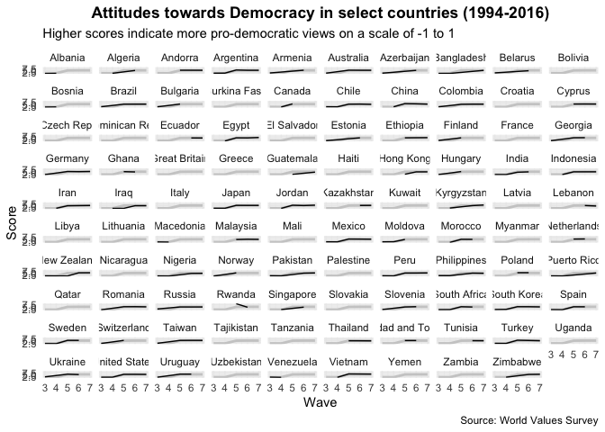
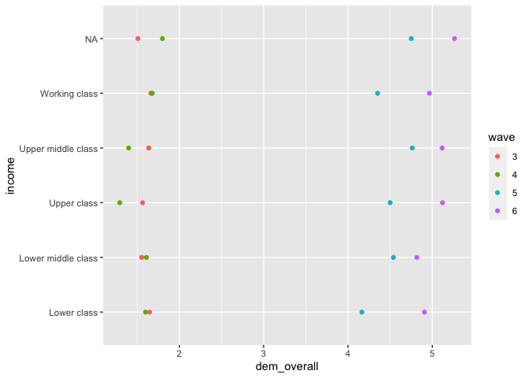
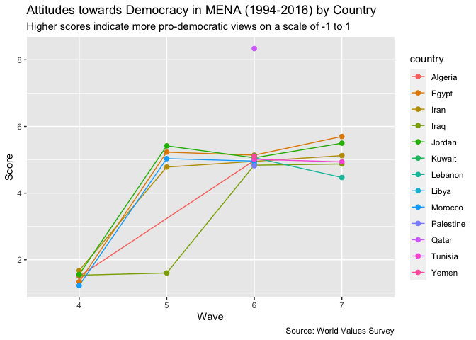
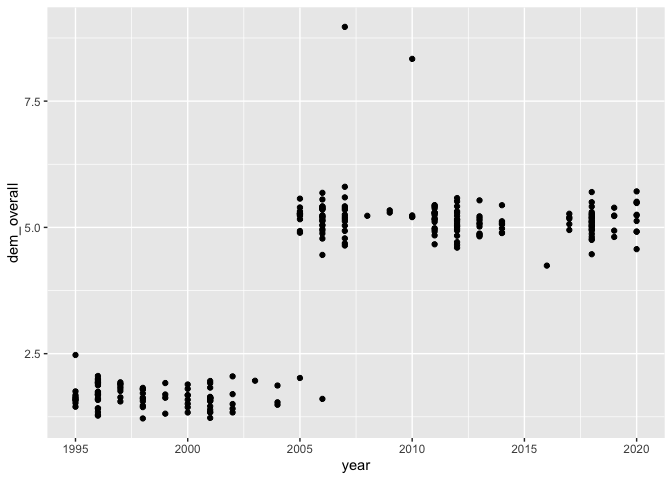

DDRL
================

``` r
library(tidyverse)
```

    ## ── Attaching packages ───────────────────────────────────────────────────────────────────────────────────────────── tidyverse 1.3.0 ──

    ## ✓ ggplot2 3.3.2     ✓ purrr   0.3.4
    ## ✓ tibble  3.0.3     ✓ dplyr   1.0.0
    ## ✓ tidyr   1.1.0     ✓ stringr 1.4.0
    ## ✓ readr   1.3.1     ✓ forcats 0.5.0

    ## ── Conflicts ──────────────────────────────────────────────────────────────────────────────────────────────── tidyverse_conflicts() ──
    ## x dplyr::filter() masks stats::filter()
    ## x dplyr::lag()    masks stats::lag()

``` r
library(readxl)
library(lfe)
```

    ## Loading required package: Matrix

    ## 
    ## Attaching package: 'Matrix'

    ## The following objects are masked from 'package:tidyr':
    ## 
    ##     expand, pack, unpack

``` r
wvs <- 
  read_csv("data/wvs_cleaned.csv", guess_max = 300000) %>% 
  select(-c(dem_imp, dem_political_sys)) %>% 
  mutate(age = year - birth_year) %>% 
  filter(
    !is.na(dem_overall), 
    country != "Channel Islands"
    ) %>% 
  mutate(
    ranking = 
      case_when(
      education == "No formal education"  ~ 1,
      education == "Incomplete elementary" ~ 2,
      education == "Complete elementary" ~ 3,
      education == "Incomplete secondary" ~ 4,
      education == "Complete secondary" ~ 5,
      education == "Some higher education"  ~ 6,
      education == "Higher education"  ~ 7
    ), 
    education = fct_reorder(education, ranking)
  )
```

    ## Parsed with column specification:
    ## cols(
    ##   wave = col_double(),
    ##   country_code = col_double(),
    ##   year = col_double(),
    ##   weight = col_double(),
    ##   gender = col_character(),
    ##   birth_year = col_double(),
    ##   education = col_character(),
    ##   employment = col_character(),
    ##   income = col_character(),
    ##   dem_imp = col_double(),
    ##   dem_political_sys = col_double(),
    ##   country = col_character(),
    ##   dem_overall = col_double(),
    ##   region = col_character(),
    ##   sub_region = col_character()
    ## )

``` r
wvs %>% 
  summarise_all(~ sum(is.na(.))) 
```

    ## # A tibble: 1 x 15
    ##    wave country_code  year weight gender birth_year education employment income
    ##   <int>        <int> <int>  <int>  <int>      <int>     <int>      <int>  <int>
    ## 1     0            0     0      0    260       3830     85672       7599  21981
    ## # … with 6 more variables: country <int>, dem_overall <int>, region <int>,
    ## #   sub_region <int>, age <int>, ranking <int>

``` r
#png("dem_hist.png", width = 8, height = 5, units = "in", res = 300)

wvs %>% 
  ggplot(aes(dem_overall)) + 
  geom_histogram(bins = 20) + 
  labs(
    x = "Attitudes towards Democracy", 
    y = "Number", 
    title = "Histogram of Attitudes towards Democracy", 
    subtitle = "Higher scores indicate more pro-democratic views on a scale of -1 to 1",
    caption = "Source: World Values Survey"
  ) + 
  theme(
    plot.title = element_text(hjust = 0.5, face = "bold")
  )
```

<!-- -->

``` r
#dev.off()
```

``` r
###BY Country 
#png("all_countries.png", width = 8, height = 9, units = "in", res = 300)

wvs %>% 
  filter(wave == 6) %>% 
  group_by(country, region, year) %>% 
  summarize(dem_overall = weighted.mean(dem_overall, w = weight, na.rm = TRUE)) %>% 
  ungroup() %>% 
  mutate(
    country = fct_reorder(country, dem_overall),
    year = as.factor(year)
    ) %>% 
  ggplot(aes(dem_overall, country)) + 
  geom_point(aes(color = region)) +
  geom_text(aes(label = year), nudge_x = 0.03, size = 3) +
  scale_color_discrete(name = "Region") + 
  labs(
    x = "Attitudes towards Democracy", 
    y = NULL, 
    title = "Attitudes towards Democracy in Wave 6 by Country", 
    subtitle = "Higher scores indicate more pro-democratic views on a scale of -1 to 1",
    caption = "Source: World Values Survey"
  ) + 
  theme(
    plot.title = element_text(hjust = 0.5, face = "bold")
  )
```

    ## `summarise()` regrouping output by 'country', 'region' (override with `.groups` argument)

<!-- -->

``` r
#dev.off()
```

``` r
###BY Region
#png("dem_regions.png", width = 8, height = 5, units = "in", res = 300)

wvs %>% 
  filter(wave == 6) %>% 
  group_by(country, region) %>% 
  summarize(dem_overall = weighted.mean(dem_overall, w = weight, na.rm = TRUE)) %>% 
  group_by(region) %>% 
  summarize(dem_overall = mean(dem_overall, na.rm = TRUE)) %>% 
  mutate(region = fct_reorder(region, dem_overall)) %>% 
  ggplot(aes(dem_overall, region)) + 
  geom_point() + 
  labs(
    x = "Attitudes towards Democracy", 
    y = NULL, 
    title = "Attitudes towards Democracy in Wave 6 by Region", 
    subtitle = "Higher scores indicate more pro-democratic views on a scale of -1 to 1",
    caption = "Source: World Values Survey"
  ) + 
  theme(
    plot.title = element_text(hjust = 0.5, face = "bold")
  ) + 
  coord_cartesian(xlim = c(0.2, 0.9))
```

    ## `summarise()` regrouping output by 'country' (override with `.groups` argument)

    ## `summarise()` ungrouping output (override with `.groups` argument)

<!-- -->

``` r
#dev.off()

wvs %>% 
  filter(wave == 6) %>% 
  group_by(country, region) %>% 
  summarize(dem_overall = weighted.mean(dem_overall, w = weight, na.rm = TRUE)) %>% 
  filter(region == "Europe & Central Asia")
```

    ## `summarise()` regrouping output by 'country' (override with `.groups` argument)

    ## # A tibble: 19 x 3
    ## # Groups:   country [19]
    ##    country     region                dem_overall
    ##    <chr>       <chr>                       <dbl>
    ##  1 Armenia     Europe & Central Asia        5.29
    ##  2 Azerbaijan  Europe & Central Asia        5.11
    ##  3 Belarus     Europe & Central Asia        4.67
    ##  4 Cyprus      Europe & Central Asia        5.29
    ##  5 Estonia     Europe & Central Asia        5.24
    ##  6 Georgia     Europe & Central Asia        5.44
    ##  7 Germany     Europe & Central Asia        5.18
    ##  8 Kazakhstan  Europe & Central Asia        5.18
    ##  9 Kyrgyzstan  Europe & Central Asia        4.98
    ## 10 Netherlands Europe & Central Asia        5.51
    ## 11 Poland      Europe & Central Asia        5.58
    ## 12 Romania     Europe & Central Asia        5.28
    ## 13 Russia      Europe & Central Asia        4.92
    ## 14 Slovenia    Europe & Central Asia        5.27
    ## 15 Spain       Europe & Central Asia        5.15
    ## 16 Sweden      Europe & Central Asia        5.38
    ## 17 Turkey      Europe & Central Asia        5.29
    ## 18 Ukraine     Europe & Central Asia        4.84
    ## 19 Uzbekistan  Europe & Central Asia        5.43

``` r
gdp <- 
  read_xls("data/gdp_per_capita.xls") %>% 
  gather(key = year, value = gdp_pc, -country) %>% 
  mutate(year = as.integer(str_remove(year, "pc_")))

#png("dem_gdp.png", width = 7, height = 7, units = "in", res = 300)

wvs %>% 
  filter(wave == 6) %>% 
  group_by(country, region, year) %>% 
  summarize(dem_overall = weighted.mean(dem_overall, w = weight, na.rm = TRUE)) %>% 
  left_join(
    gdp, by = c("country", "year")
  ) %>% 
  ggplot(aes(gdp_pc, dem_overall, color = region)) + 
  geom_point() + 
  ggrepel::geom_text_repel(aes(label = country), size = 3) + 
  scale_color_discrete(name = NULL) + 
  scale_x_log10() + 
  labs(
    x = "GDP per Capita", 
    y = "Attitudes towards Democracy", 
    title = "Attitudes towards Democracy vs GDP per Capita in Wave 6", 
    subtitle = "Higher scores indicate more pro-democratic views on a scale of -1 to 1",
    caption = "Source: World Values Survey"
  ) + 
  theme(
    plot.title = element_text(hjust = 0.5, face = "bold"), 
    legend.position = "bottom"
  )
```

    ## `summarise()` regrouping output by 'country', 'region' (override with `.groups` argument)

    ## Warning: Removed 1 rows containing missing values (geom_point).

    ## Warning: Removed 1 rows containing missing values (geom_text_repel).

<!-- -->

``` r
#dev.off()
```

``` r
world <- 
  wvs %>% 
  group_by(wave, country) %>% 
  summarise(dem_overall = weighted.mean(dem_overall, w = weight, na.rm = TRUE)) %>% 
  group_by(wave) %>% 
  summarize(dem_overall = mean(dem_overall))
```

    ## `summarise()` regrouping output by 'wave' (override with `.groups` argument)

    ## `summarise()` ungrouping output (override with `.groups` argument)

``` r
#png("dem_region_time.png", width = 7, height = 7, units = "in", res = 300)

wvs %>% 
  group_by(wave, country, region) %>% 
  summarise(dem_overall = weighted.mean(dem_overall, w = weight, na.rm = TRUE)) %>% 
  group_by(wave, region) %>% 
  summarise(dem_overall = mean(dem_overall, na.rm = TRUE)) %>% 
  ggplot(aes(wave, dem_overall)) + 
  geom_line(data = world, color = "gray80", size = 1) +
  geom_line() + #color = "#01babe"
  facet_wrap(vars(region)) + 
  scale_y_continuous(breaks = seq(0.2, 0.7, 0.1), minor_breaks = NULL) + 
  scale_x_continuous(minor_breaks = NULL) + 
  # theme_minimal() + 
  labs(
    x = "Wave", 
    y = "Score", 
    title = "Attitudes towards Democracy (1994-2016) by Region",
    subtitle = "Higher scores indicate more pro-democratic views on a scale of -1 to 1",
    caption = "Source: World Values Survey"
  ) + 
  theme(
    plot.title = element_text(hjust = 0.5, face = "bold")
  )
```

    ## `summarise()` regrouping output by 'wave', 'country' (override with `.groups` argument)

    ## `summarise()` regrouping output by 'wave' (override with `.groups` argument)

<!-- -->

``` r
#dev.off()
```

``` r
#png("Europe.png", width = 7, height = 5, units = "in", res = 300)

wvs %>% 
  group_by(wave, country, region, sub_region) %>% 
  summarise(dem_overall = weighted.mean(dem_overall, w = weight, na.rm = TRUE)) %>% 
  filter(region == "Europe & Central Asia") %>% 
  group_by(wave, sub_region) %>% 
  summarise(dem_overall = mean(dem_overall, na.rm = TRUE)) %>% 
  ggplot(aes(wave, dem_overall, color = sub_region)) + 
  geom_line() + 
  geom_point(data = . %>% filter(wave == 3)) + 
  ggrepel::geom_text_repel(
    data = . %>% filter(wave == 3), 
    aes(label = sub_region), 
    hjust = 0, 
    nudge_x = -1, 
    nudge_y = 0
  ) + 
  coord_cartesian(xlim = c(2.4, 6)) + 
  theme_minimal() + 
  theme(legend.position = "none") +
  labs(
    x = "Wave", 
    y = "Score", 
    title = "Attitudes towards Democracy in Europe & Central Asia (1994-2016)",
    subtitle = "Higher scores indicate more pro-democratic views on a scale of -1 to 1",
    caption = "Source: World Values Survey"
  ) + 
  theme(
    plot.title = element_text(hjust = 0.5, face = "bold")
  ) 
```

    ## `summarise()` regrouping output by 'wave', 'country', 'region' (override with `.groups` argument)

    ## `summarise()` regrouping output by 'wave' (override with `.groups` argument)

<!-- -->

``` r
#dev.off()
```

``` r
# wvs %>% 
#   filter(
#     region == "Europe & Central Asia", 
#     sub_region == "Northern Europe"
#     ) %>% 
#   group_by(wave, country) %>% 
#   summarise(dem_overall = weighted.mean(dem_overall, w = weight, na.rm = TRUE)) %>% 
#   ggplot(aes(wave, dem_overall, color = country)) + 
#   geom_line()
# 
# wvs %>% 
#   filter(
#     region == "Europe & Central Asia", 
#     sub_region == "Central Asia"
#     ) %>% 
#   group_by(wave, country) %>% 
#   summarise(dem_overall = weighted.mean(dem_overall, w = weight, na.rm = TRUE)) %>% 
#   ggplot(aes(wave, dem_overall, color = country)) + 
#   geom_line()
# 
# wvs %>% 
#   filter(
#     region == "Europe & Central Asia", 
#     sub_region == "Eastern Europe"
#     ) %>% 
#   group_by(wave, country) %>% 
#   summarise(dem_overall = weighted.mean(dem_overall, w = weight, na.rm = TRUE)) %>% 
#   ggplot(aes(wave, dem_overall, color = country)) + 
#   geom_line()
# 
# wvs %>% 
#   filter(
#     region == "Europe & Central Asia", 
#     sub_region == "Central Asia"
#     ) %>% 
#   group_by(wave, country) %>% 
#   summarise(dem_overall = weighted.mean(dem_overall, w = weight, na.rm = TRUE)) %>% 
#   ggplot(aes(wave, dem_overall, color = country)) + 
#   geom_line()
```

``` r
four_wave_countries <- 
  wvs %>% 
  count(wave, country) %>% 
  count(country, sort = TRUE) %>% 
  filter(n > 3) %>% 
  pull(country)
```

    ## Using `n` as weighting variable
    ## ℹ Quiet this message with `wt = n` or count rows with `wt = 1`

``` r
#png("Select.png", width = 7, height = 5, units = "in", res = 300)
wvs %>% 
  filter(country %in% four_wave_countries) %>% 
  group_by(wave, country, region) %>% 
  summarise(dem_overall = weighted.mean(dem_overall, w = weight, na.rm = TRUE)) %>% 
  ggplot(aes(wave, dem_overall)) + 
  geom_line(data = world, color = "gray80", size = 1) +
  geom_line() + 
  facet_wrap(vars(country)) + 
  labs(
    x = "Wave", 
    y = "Score", 
    title = "Attitudes towards Democracy in select countries (1994-2016)",
    subtitle = "Higher scores indicate more pro-democratic views on a scale of -1 to 1",
    caption = "Source: World Values Survey"
  ) + 
  theme_minimal() + 
  theme(
    plot.title = element_text(hjust = 0.5, face = "bold")
  ) 
```

    ## `summarise()` regrouping output by 'wave', 'country' (override with `.groups` argument)

    ## geom_path: Each group consists of only one observation. Do you need to adjust
    ## the group aesthetic?
    ## geom_path: Each group consists of only one observation. Do you need to adjust
    ## the group aesthetic?
    ## geom_path: Each group consists of only one observation. Do you need to adjust
    ## the group aesthetic?
    ## geom_path: Each group consists of only one observation. Do you need to adjust
    ## the group aesthetic?
    ## geom_path: Each group consists of only one observation. Do you need to adjust
    ## the group aesthetic?
    ## geom_path: Each group consists of only one observation. Do you need to adjust
    ## the group aesthetic?
    ## geom_path: Each group consists of only one observation. Do you need to adjust
    ## the group aesthetic?
    ## geom_path: Each group consists of only one observation. Do you need to adjust
    ## the group aesthetic?
    ## geom_path: Each group consists of only one observation. Do you need to adjust
    ## the group aesthetic?
    ## geom_path: Each group consists of only one observation. Do you need to adjust
    ## the group aesthetic?
    ## geom_path: Each group consists of only one observation. Do you need to adjust
    ## the group aesthetic?
    ## geom_path: Each group consists of only one observation. Do you need to adjust
    ## the group aesthetic?
    ## geom_path: Each group consists of only one observation. Do you need to adjust
    ## the group aesthetic?
    ## geom_path: Each group consists of only one observation. Do you need to adjust
    ## the group aesthetic?
    ## geom_path: Each group consists of only one observation. Do you need to adjust
    ## the group aesthetic?
    ## geom_path: Each group consists of only one observation. Do you need to adjust
    ## the group aesthetic?
    ## geom_path: Each group consists of only one observation. Do you need to adjust
    ## the group aesthetic?
    ## geom_path: Each group consists of only one observation. Do you need to adjust
    ## the group aesthetic?
    ## geom_path: Each group consists of only one observation. Do you need to adjust
    ## the group aesthetic?
    ## geom_path: Each group consists of only one observation. Do you need to adjust
    ## the group aesthetic?
    ## geom_path: Each group consists of only one observation. Do you need to adjust
    ## the group aesthetic?
    ## geom_path: Each group consists of only one observation. Do you need to adjust
    ## the group aesthetic?
    ## geom_path: Each group consists of only one observation. Do you need to adjust
    ## the group aesthetic?
    ## geom_path: Each group consists of only one observation. Do you need to adjust
    ## the group aesthetic?
    ## geom_path: Each group consists of only one observation. Do you need to adjust
    ## the group aesthetic?
    ## geom_path: Each group consists of only one observation. Do you need to adjust
    ## the group aesthetic?
    ## geom_path: Each group consists of only one observation. Do you need to adjust
    ## the group aesthetic?

<!-- -->

``` r
#dev.off()
```

``` r
# wvs %>% 
#   filter(country %in% four_wave_countries) %>% 
#   group_by(country, region, year, wave) %>% 
#   summarize(dem_overall = weighted.mean(dem_overall, w = weight, na.rm = TRUE)) %>% 
#   left_join(
#     gdp, by = c("country", "year")
#   ) %>% 
#   ungroup() %>% 
#   mutate(country  = fct_reorder(country, year)) %>% 
#   ggplot(aes(gdp_pc, dem_overall, color = country)) + 
#   geom_line() + 
#   geom_point(data = . %>% filter(wave == 3)) + 
#   scale_x_log10() 
```

``` r
wvs_6 <- 
  wvs %>% 
  filter(wave == 6) 

fit_1 <- lm(dem_overall ~ education, data = wvs_6)
summary(fit_1)
```

    ## 
    ## Call:
    ## lm(formula = dem_overall ~ education, data = wvs_6)
    ## 
    ## Residuals:
    ##     Min      1Q  Median      3Q     Max 
    ## -4.2524 -0.6069  0.2476  0.4760  5.0173 
    ## 
    ## Coefficients:
    ##                                Estimate Std. Error t value Pr(>|t|)    
    ## (Intercept)                     4.98267    0.01841 270.647  < 2e-16 ***
    ## educationComplete elementary    0.13880    0.02272   6.110 9.99e-10 ***
    ## educationIncomplete secondary   0.04137    0.02149   1.925   0.0542 .  
    ## educationComplete secondary     0.12425    0.01979   6.279 3.43e-10 ***
    ## educationSome higher education  0.18258    0.02429   7.518 5.64e-14 ***
    ## educationHigher education       0.26969    0.02115  12.748  < 2e-16 ***
    ## ---
    ## Signif. codes:  0 '***' 0.001 '**' 0.01 '*' 0.05 '.' 0.1 ' ' 1
    ## 
    ## Residual standard error: 1.297 on 82274 degrees of freedom
    ##   (5855 observations deleted due to missingness)
    ## Multiple R-squared:  0.003673,   Adjusted R-squared:  0.003613 
    ## F-statistic: 60.67 on 5 and 82274 DF,  p-value: < 2.2e-16

``` r
fit_2 <- lm(dem_overall ~ education + gender + age + employment + income, data = wvs_6)
summary(fit_2)
```

    ## 
    ## Call:
    ## lm(formula = dem_overall ~ education + gender + age + employment + 
    ##     income, data = wvs_6)
    ## 
    ## Residuals:
    ##     Min      1Q  Median      3Q     Max 
    ## -4.4586 -0.5975  0.1923  0.4997  5.2700 
    ## 
    ## Coefficients:
    ##                                  Estimate Std. Error t value Pr(>|t|)    
    ## (Intercept)                     4.6831271  0.0295812 158.314  < 2e-16 ***
    ## educationComplete elementary    0.1375742  0.0230983   5.956 2.60e-09 ***
    ## educationIncomplete secondary   0.0727596  0.0221906   3.279  0.00104 ** 
    ## educationComplete secondary     0.1235819  0.0205690   6.008 1.88e-09 ***
    ## educationSome higher education  0.1590619  0.0254964   6.239 4.44e-10 ***
    ## educationHigher education       0.2063314  0.0225268   9.159  < 2e-16 ***
    ## genderMale                     -0.0403968  0.0098351  -4.107 4.01e-05 ***
    ## age                             0.0057124  0.0003777  15.123  < 2e-16 ***
    ## employmentHousewife             0.0006555  0.0159886   0.041  0.96730    
    ## employmentOther                -0.0359836  0.0375372  -0.959  0.33776    
    ## employmentPart time            -0.0762657  0.0169490  -4.500 6.81e-06 ***
    ## employmentRetired              -0.1073916  0.0184564  -5.819 5.96e-09 ***
    ## employmentSelf Employed        -0.1054859  0.0156270  -6.750 1.49e-11 ***
    ## employmentStudent              -0.0034655  0.0194877  -0.178  0.85886    
    ## employmentUnemployed           -0.0093475  0.0174098  -0.537  0.59133    
    ## incomeLower middle class        0.1395066  0.0159532   8.745  < 2e-16 ***
    ## incomeUpper class               0.1861970  0.0350236   5.316 1.06e-07 ***
    ## incomeUpper middle class        0.2492832  0.0176540  14.120  < 2e-16 ***
    ## incomeWorking class             0.1072942  0.0163832   6.549 5.83e-11 ***
    ## ---
    ## Signif. codes:  0 '***' 0.001 '**' 0.01 '*' 0.05 '.' 0.1 ' ' 1
    ## 
    ## Residual standard error: 1.266 on 77295 degrees of freedom
    ##   (10821 observations deleted due to missingness)
    ## Multiple R-squared:  0.01077,    Adjusted R-squared:  0.01054 
    ## F-statistic: 46.77 on 18 and 77295 DF,  p-value: < 2.2e-16

``` r
fit_3 <- felm(dem_overall ~  education + gender + age + employment + income | country, data = wvs_6)
summary(fit_3)
```

    ## 
    ## Call:
    ##    felm(formula = dem_overall ~ education + gender + age + employment +      income | country, data = wvs_6) 
    ## 
    ## Residuals:
    ##     Min      1Q  Median      3Q     Max 
    ## -7.4995 -0.5281  0.1757  0.5726  5.3369 
    ## 
    ## Coefficients:
    ##                                  Estimate Std. Error t value Pr(>|t|)    
    ## educationComplete elementary    0.1004877  0.0224060   4.485 7.31e-06 ***
    ## educationIncomplete secondary   0.0518278  0.0216612   2.393 0.016729 *  
    ## educationComplete secondary     0.1119875  0.0204242   5.483 4.19e-08 ***
    ## educationSome higher education  0.1359524  0.0250068   5.437 5.45e-08 ***
    ## educationHigher education       0.1723765  0.0223517   7.712 1.25e-14 ***
    ## genderMale                     -0.0365743  0.0094404  -3.874 0.000107 ***
    ## age                             0.0039739  0.0003756  10.580  < 2e-16 ***
    ## employmentHousewife             0.0098534  0.0158908   0.620 0.535213    
    ## employmentOther                 0.0147038  0.0362748   0.405 0.685225    
    ## employmentPart time            -0.0263098  0.0162144  -1.623 0.104675    
    ## employmentRetired              -0.0405160  0.0177046  -2.288 0.022115 *  
    ## employmentSelf Employed         0.0207326  0.0156111   1.328 0.184159    
    ## employmentStudent               0.0350228  0.0186423   1.879 0.060293 .  
    ## employmentUnemployed            0.0074748  0.0169591   0.441 0.659391    
    ## incomeLower middle class        0.0740026  0.0156271   4.736 2.19e-06 ***
    ## incomeUpper class               0.0521845  0.0335679   1.555 0.120046    
    ## incomeUpper middle class        0.0859552  0.0174380   4.929 8.27e-07 ***
    ## incomeWorking class             0.0565762  0.0159221   3.553 0.000381 ***
    ## ---
    ## Signif. codes:  0 '***' 0.001 '**' 0.01 '*' 0.05 '.' 0.1 ' ' 1
    ## 
    ## Residual standard error: 1.196 on 77238 degrees of freedom
    ##   (10821 observations deleted due to missingness)
    ## Multiple R-squared(full model): 0.1181   Adjusted R-squared: 0.1172 
    ## Multiple R-squared(proj model): 0.003552   Adjusted R-squared: 0.002584 
    ## F-statistic(full model):137.8 on 75 and 77238 DF, p-value: < 2.2e-16 
    ## F-statistic(proj model):  15.3 on 18 and 77238 DF, p-value: < 2.2e-16

``` r
fit_4 <- felm(dem_overall ~  education + gender + age + employment + income | country + year, data = wvs)
summary(fit_4)
```

    ## 
    ## Call:
    ##    felm(formula = dem_overall ~ education + gender + age + employment +      income | country + year, data = wvs) 
    ## 
    ## Residuals:
    ##     Min      1Q  Median      3Q     Max 
    ## -7.4351 -0.5872  0.1041  0.4719  6.7702 
    ## 
    ## Coefficients:
    ##                                  Estimate Std. Error t value Pr(>|t|)    
    ## educationComplete elementary    0.0080517  0.0098292   0.819 0.412698    
    ## educationIncomplete secondary  -0.0319663  0.0097448  -3.280 0.001037 ** 
    ## educationComplete secondary    -0.0253669  0.0092050  -2.756 0.005856 ** 
    ## educationSome higher education -0.0597710  0.0117005  -5.108 3.25e-07 ***
    ## educationHigher education      -0.0385938  0.0103545  -3.727 0.000194 ***
    ## genderMale                     -0.0364984  0.0047240  -7.726 1.11e-14 ***
    ## age                             0.0011610  0.0001896   6.124 9.15e-10 ***
    ## employmentHousewife             0.0032423  0.0078838   0.411 0.680881    
    ## employmentOther                 0.0149678  0.0166686   0.898 0.369204    
    ## employmentPart time            -0.0187184  0.0084613  -2.212 0.026952 *  
    ## employmentRetired              -0.0034177  0.0088313  -0.387 0.698758    
    ## employmentSelf Employed         0.0198444  0.0076894   2.581 0.009859 ** 
    ## employmentStudent               0.0114798  0.0091958   1.248 0.211897    
    ## employmentUnemployed           -0.0087482  0.0080978  -1.080 0.280005    
    ## incomeLower middle class       -0.0075974  0.0075736  -1.003 0.315799    
    ## incomeUpper class               0.0095234  0.0176713   0.539 0.589943    
    ## incomeUpper middle class       -0.0017042  0.0085469  -0.199 0.841955    
    ## incomeWorking class            -0.0125069  0.0077645  -1.611 0.107231    
    ## ---
    ## Signif. codes:  0 '***' 0.001 '**' 0.01 '*' 0.05 '.' 0.1 ' ' 1
    ## 
    ## Residual standard error: 1.038 on 236455 degrees of freedom
    ##   (113893 observations deleted due to missingness)
    ## Multiple R-squared(full model): 0.7424   Adjusted R-squared: 0.7422 
    ## Multiple R-squared(proj model): 0.001084   Adjusted R-squared: 0.0005564 
    ## F-statistic(full model): 5451 on 125 and 236455 DF, p-value: < 2.2e-16 
    ## F-statistic(proj model): 14.26 on 18 and 236455 DF, p-value: < 2.2e-16

``` r
#png("education_level.png", width = 7, height = 7, units = "in", res = 300)

wvs %>% 
  count(education) %>% 
  mutate(
    ranking = 
      case_when(
      education == "No formal education"  ~ 1,
      education == "Incomplete elementary" ~ 2,
      education == "Complete elementary" ~ 3,
      education == "Incomplete secondary" ~ 4,
      education == "Complete secondary" ~ 5,
      education == "Some higher education"  ~ 6,
      education == "Higher education"  ~ 7
    ), 
    education = fct_reorder(education, ranking)
  ) %>% 
  ggplot(aes(education, n)) + 
  geom_col() + 
  theme(
    axis.text.x = element_text(angle = 45, hjust = 1)
  ) + 
  labs(
    x = NULL, 
    y = "Count", 
    title = "Respondents' Level of Education", 
    caption = "Source: World Values Survey"
  ) + 
  theme(
    plot.title = element_text(hjust = 0.5, face = "bold")
  ) 
```

<!-- -->

``` r
#dev.off()
```

``` r
#png("education_vs_income.png", width = 7, height = 5, units = "in", res = 300)
wvs %>% 
  mutate(
    ranking = 
      case_when(
      income == "Lower class"  ~ 1,
      income == "Working class" ~ 2,
      income == "Lower middle class" ~ 3,
      income == "Upper middle class" ~ 4,
      income == "Upper class" ~ 5
    ), 
    income = fct_reorder(income, ranking)
  ) %>% 
  count(education, income) %>% 
  group_by(income) %>% 
  mutate(prop = n / sum(n)) %>% 
  drop_na() %>% 
  ggplot(aes(education, income, size = prop, color = prop)) + 
  geom_point() + 
  scale_color_viridis_c(name = "proportion") + 
  theme(
    axis.text.x = element_text(angle = 20, hjust = 1)
  ) + 
  labs(
    x = NULL, 
    y = NULL, 
    title = "Income versus levels of education", 
    caption = "Source: World Values Survey"
  ) + 
  theme(
    plot.title = element_text(hjust = 0.5, face = "bold")
  )
```

<!-- -->

``` r
#dev.off()

wvs %>% 
  mutate(
    ranking = 
      case_when(
      income == "Lower class"  ~ 1,
      income == "Working class" ~ 2,
      income == "Lower middle class" ~ 3,
      income == "Upper middle class" ~ 4,
      income == "Upper class" ~ 5
    ), 
    income = fct_reorder(income, ranking)
  ) %>% 
  count(education, income) %>% 
  group_by(income) %>% 
  mutate(prop = n / sum(n)) %>% 
  arrange(income)
```

    ## # A tibble: 42 x 4
    ## # Groups:   income [6]
    ##    education             income            n   prop
    ##    <fct>                 <fct>         <int>  <dbl>
    ##  1 Incomplete elementary Lower class    5981 0.138 
    ##  2 Complete elementary   Lower class    6679 0.154 
    ##  3 Incomplete secondary  Lower class    6564 0.151 
    ##  4 Complete secondary    Lower class    8406 0.194 
    ##  5 Some higher education Lower class     898 0.0207
    ##  6 Higher education      Lower class    1106 0.0255
    ##  7 <NA>                  Lower class   13696 0.316 
    ##  8 Incomplete elementary Working class  6311 0.0685
    ##  9 Complete elementary   Working class 12134 0.132 
    ## 10 Incomplete secondary  Working class 14087 0.153 
    ## # … with 32 more rows

``` r
#png("age_hist.png", width = 7, height = 5, units = "in", res = 300)
wvs %>% 
  ggplot(aes(age)) + 
  geom_histogram(bins = 20) + 
  labs(
    x = "Age", 
    y = "Count", 
    title = "Histogram of Respondents' Age"
  ) + 
  theme(
    plot.title = element_text(hjust = 0.5, face = "bold")
  )
```

    ## Warning: Removed 3830 rows containing non-finite values (stat_bin).

<!-- -->

``` r
#dev.off()
```

``` r
#png("south_asia.png", width = 7, height = 5, units = "in", res = 300)

wvs %>% 
  filter(region == "South Asia") %>% 
  group_by(wave, country, region) %>% 
  summarise(dem_overall = weighted.mean(dem_overall, w = weight, na.rm = TRUE)) %>% 
  ggplot(aes(wave, dem_overall, color = country)) + 
  geom_line() + 
  geom_point(size = 2) + 
  labs(
    x = "Wave", 
    y = "Score", 
    title = "Attitudes towards Democracy in South Asia (1994-2016) by Country",
    subtitle = "Higher scores indicate more pro-democratic views on a scale of -1 to 1",
    caption = "Source: World Values Survey"
  )
```

    ## `summarise()` regrouping output by 'wave', 'country' (override with `.groups` argument)

<!-- -->

``` r
#dev.off()
```

``` r
#png("n_america.png", width = 7, height = 5, units = "in", res = 300)

wvs %>% 
  filter(region == "North America") %>% 
  group_by(wave, country, region) %>% 
  summarise(dem_overall = weighted.mean(dem_overall, w = weight, na.rm = TRUE)) %>% 
  ungroup() %>% 
  mutate(wave = as.factor(wave)) %>% 
  ggplot(aes(wave, dem_overall)) + 
    geom_line(
    data = world %>% mutate(wave = as.factor(wave)), 
    color = "gray80", 
    size = 1, 
    aes(group = 1)) +
  geom_line(aes(group = country, color = country)) +
  geom_point(aes(color = country, group = country), size = 2) + 
  labs(
    x = "Wave", 
    y = "Score", 
    title = "Attitudes towards Democracy in North America (1994-2016) by Country",
    subtitle = "Higher scores indicate more pro-democratic views on a scale of -1 to 1",
    caption = "Source: World Values Survey"
  )
```

    ## `summarise()` regrouping output by 'wave', 'country' (override with `.groups` argument)

<!-- -->

``` r
#dev.off()
```

``` r
#png("Latin_america.png", width = 7, height = 5, units = "in", res = 300)

wvs %>% 
  filter(region == "Latin America & Caribbean") %>% 
  group_by(wave, country, region) %>% 
  summarise(dem_overall = weighted.mean(dem_overall, w = weight, na.rm = TRUE)) %>% 
  ungroup() %>% 
  mutate(wave = as.factor(wave)) %>% 
  ggplot(aes(wave, dem_overall, color = country, group = country)) + 
  geom_line() + 
  geom_point(size = 2) + 
  labs(
    x = "Wave", 
    y = "Score", 
    title = "Attitudes towards Democracy in Latin America (1994-2016) by Country",
    subtitle = "Higher scores indicate more pro-democratic views on a scale of -1 to 1",
    caption = "Source: World Values Survey"
  )
```

    ## `summarise()` regrouping output by 'wave', 'country' (override with `.groups` argument)

<!-- -->

``` r
#dev.off()
```

``` r
#png("E_asia.png", width = 7, height = 5, units = "in", res = 300)

wvs %>% 
  filter(region == "East Asia & Pacific") %>% 
  group_by(wave, country, region) %>% 
  summarise(dem_overall = weighted.mean(dem_overall, w = weight, na.rm = TRUE)) %>% 
  ungroup() %>% 
  mutate(wave = as.factor(wave)) %>% 
  ggplot(aes(wave, dem_overall, color = country, group = country)) + 
  geom_line() + 
  geom_point(size = 2) + 
  labs(
    x = "Wave", 
    y = "Score", 
    title = "Attitudes towards Democracy in East Asia & Pacific (1994-2016) by Country",
    subtitle = "Higher scores indicate more pro-democratic views on a scale of -1 to 1",
    caption = "Source: World Values Survey"
  )
```

    ## `summarise()` regrouping output by 'wave', 'country' (override with `.groups` argument)

<!-- -->

``` r
#dev.off()
```

``` r
#png("Africa.png", width = 7, height = 5, units = "in", res = 300)

wvs %>% 
  filter(region == "Sub-Saharan Africa") %>% 
  group_by(wave, country, region) %>% 
  summarise(dem_overall = weighted.mean(dem_overall, w = weight, na.rm = TRUE)) %>% 
  ungroup() %>% 
  mutate(wave = as.factor(wave)) %>% 
  ggplot(aes(wave, dem_overall, color = country, group = country)) + 
  geom_line() + 
  geom_point(size = 2) + 
  labs(
    x = "Wave", 
    y = "Score", 
    title = "Attitudes towards Democracy in Sub-Saharan Africa (1994-2016) by Country",
    subtitle = "Higher scores indicate more pro-democratic views on a scale of -1 to 1",
    caption = "Source: World Values Survey"
  )
```

    ## `summarise()` regrouping output by 'wave', 'country' (override with `.groups` argument)

<!-- -->

``` r
#dev.off()
```

\#\#\#India

``` r
wvs %>% 
  filter(country == "India") %>% 
  mutate(wave = as.factor(wave)) %>% 
  ggplot(aes(education, dem_overall, color = wave)) + 
  geom_count()
```

<!-- -->

``` r
wvs %>% 
  filter(country == "India") %>%
  mutate(wave = as.factor(wave)) %>% 
  group_by(wave, income) %>% 
  summarize(dem_overall = mean(dem_overall)) %>% 
  ggplot(aes(dem_overall, income, color = wave)) + 
  geom_point()
```

    ## `summarise()` regrouping output by 'wave' (override with `.groups` argument)

<!-- -->

``` r
#png("MENA.png", width = 7, height = 5, units = "in", res = 300)

wvs %>% 
  filter(region == "Middle East & North Africa") %>% 
  group_by(wave, country, region) %>% 
  summarise(dem_overall = weighted.mean(dem_overall, w = weight, na.rm = TRUE)) %>% 
  ungroup() %>% 
  mutate(wave = as.factor(wave)) %>% 
  ggplot(aes(wave, dem_overall)) + 
  geom_line(aes(group = country, color = country)) +
  geom_point(aes(color = country, group = country), size = 2) + 
  labs(
    x = "Wave", 
    y = "Score", 
    title = "Attitudes towards Democracy in MENA (1994-2016) by Country",
    subtitle = "Higher scores indicate more pro-democratic views on a scale of -1 to 1",
    caption = "Source: World Values Survey"
  )
```

    ## `summarise()` regrouping output by 'wave', 'country' (override with `.groups` argument)

<!-- -->

``` r
#dev.off()
```

``` r
wvs %>% 
  # filter(year %in% 2003:2012) %>% 
  group_by(year, country, region) %>% 
  summarise(dem_overall = weighted.mean(dem_overall, w = weight, na.rm = TRUE)) %>% 
  ggplot(aes(year, dem_overall)) + 
  geom_point()
```

    ## `summarise()` regrouping output by 'year', 'country' (override with `.groups` argument)

<!-- -->

``` r
wvs %>% 
  filter(wave == 6) %>% 
  group_by(country, region) %>% 
  summarise(dem_overall = weighted.mean(dem_overall, w = weight, na.rm = TRUE)) %>% 
  arrange(dem_overall)
```

    ## `summarise()` regrouping output by 'country' (override with `.groups` argument)

    ## # A tibble: 60 x 3
    ## # Groups:   country [60]
    ##    country   region                     dem_overall
    ##    <chr>     <chr>                            <dbl>
    ##  1 Haiti     Latin America & Caribbean         4.24
    ##  2 Rwanda    Sub-Saharan Africa                4.60
    ##  3 Nigeria   Sub-Saharan Africa                4.66
    ##  4 Belarus   Europe & Central Asia             4.67
    ##  5 Singapore East Asia & Pacific               4.71
    ##  6 Palestine Middle East & North Africa        4.82
    ##  7 Ghana     Sub-Saharan Africa                4.83
    ##  8 Iraq      Middle East & North Africa        4.84
    ##  9 Ukraine   Europe & Central Asia             4.84
    ## 10 Thailand  East Asia & Pacific               4.87
    ## # … with 50 more rows

\#\#\#Possible Research Questions - How people classify themselves as
right or left, versus what their views actually are. - How has the idea
of global citizenship changed over time - Attitudes towards democracy

Impact of the fall of 2008. Maybe look at around that time.

Events. Internal events. Relationship between economic growth and
democracy
