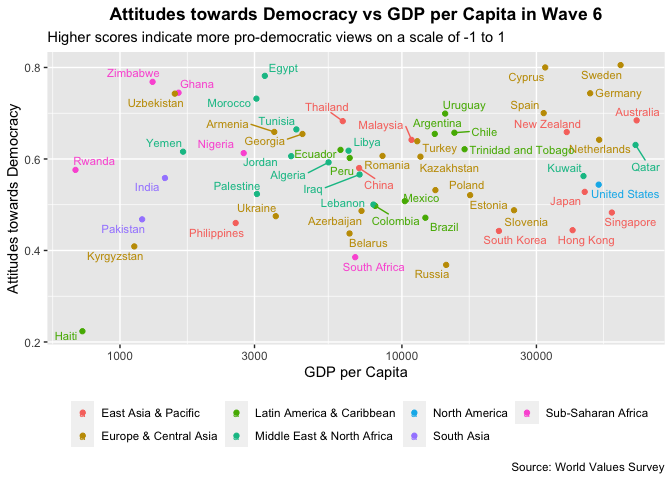

DDRL
================

``` r
library(tidyverse)
```

    ## ── Attaching packages ───────────────────────────────────────────────────────────────────────────────────────────── tidyverse 1.3.0 ──

    ## ✓ ggplot2 3.3.2     ✓ purrr   0.3.4
    ## ✓ tibble  3.0.3     ✓ dplyr   1.0.0
    ## ✓ tidyr   1.1.0     ✓ stringr 1.4.0
    ## ✓ readr   1.3.1     ✓ forcats 0.5.0

    ## ── Conflicts ──────────────────────────────────────────────────────────────────────────────────────────────── tidyverse_conflicts() ──
    ## x dplyr::filter() masks stats::filter()
    ## x dplyr::lag()    masks stats::lag()

``` r
library(readxl)
library(lfe)
```

    ## Loading required package: Matrix

    ## 
    ## Attaching package: 'Matrix'

    ## The following objects are masked from 'package:tidyr':
    ## 
    ##     expand, pack, unpack

``` r
wvs <- 
  read_csv("data/wvs_cleaned.csv", guess_max = 300000) %>% 
  select(-c(dem_imp, dem_political_sys)) %>% 
  mutate(age = year - birth_year) %>% 
  filter(
    !is.na(dem_overall), 
    country != "Channel Islands"
    ) %>% 
  mutate(
    ranking = 
      case_when(
      education == "No formal education"  ~ 1,
      education == "Incomplete elementary" ~ 2,
      education == "Complete elementary" ~ 3,
      education == "Incomplete secondary" ~ 4,
      education == "Complete secondary" ~ 5,
      education == "Some higher education"  ~ 6,
      education == "Higher education"  ~ 7
    ), 
    education = fct_reorder(education, ranking)
  )
```

    ## Parsed with column specification:
    ## cols(
    ##   wave = col_double(),
    ##   country_code = col_double(),
    ##   year = col_double(),
    ##   weight = col_double(),
    ##   gender = col_character(),
    ##   birth_year = col_double(),
    ##   education = col_character(),
    ##   employment = col_character(),
    ##   income = col_character(),
    ##   dem_imp = col_double(),
    ##   dem_political_sys = col_double(),
    ##   country = col_character(),
    ##   dem_overall = col_double(),
    ##   region = col_character(),
    ##   sub_region = col_character()
    ## )

``` r
wvs %>% 
  summarise_all(~ sum(is.na(.))) 
```

    ## # A tibble: 1 x 15
    ##    wave country_code  year weight gender birth_year education employment income
    ##   <int>        <int> <int>  <int>  <int>      <int>     <int>      <int>  <int>
    ## 1     0            0     0      0    260       3830     85672       7599  21981
    ## # … with 6 more variables: country <int>, dem_overall <int>, region <int>,
    ## #   sub_region <int>, age <int>, ranking <int>

``` r
wvs %>% 
  ggplot(aes(dem_overall)) + 
  geom_histogram(bins = 20) + 
  labs(
    x = "Attitudes towards Democracy", 
    y = "Number", 
    title = "Histogram of Attitudes towards Democracy", 
    subtitle = "Higher scores indicate more pro-democratic views on a scale of -1 to 1",
    caption = "Source: World Values Survey"
  ) + 
  theme(
    plot.title = element_text(hjust = 0.5, face = "bold")
  )
```

<!-- -->

``` r
###BY Country 

wvs %>% 
  filter(wave == 6) %>% 
  group_by(country, region, year) %>% 
  summarize(dem_overall = weighted.mean(dem_overall, w = weight, na.rm = TRUE)) %>% 
  ungroup() %>% 
  mutate(
    country = fct_reorder(country, dem_overall),
    year = as.factor(year)
    ) %>% 
  ggplot(aes(dem_overall, country)) + 
  geom_point(aes(color = region)) +
  geom_text(aes(label = year), nudge_x = 0.03, size = 3) +
  scale_color_discrete(name = "Region") + 
  labs(
    x = "Attitudes towards Democracy", 
    y = NULL, 
    title = "Attitudes towards Democracy in Wave 6 by Country", 
    subtitle = "Higher scores indicate more pro-democratic views on a scale of -1 to 1",
    caption = "Source: World Values Survey"
  ) + 
  theme(
    plot.title = element_text(hjust = 0.5, face = "bold")
  )
```

    ## `summarise()` regrouping output by 'country', 'region' (override with `.groups` argument)

<!-- -->

``` r
###BY Region

wvs %>% 
  filter(wave == 6) %>% 
  group_by(country, region) %>% 
  summarize(dem_overall = weighted.mean(dem_overall, w = weight, na.rm = TRUE)) %>% 
  group_by(region) %>% 
  summarize(dem_overall = mean(dem_overall, na.rm = TRUE)) %>% 
  mutate(region = fct_reorder(region, dem_overall)) %>% 
  ggplot(aes(dem_overall, region)) + 
  geom_point() + 
  labs(
    x = "Attitudes towards Democracy", 
    y = NULL, 
    title = "Attitudes towards Democracy in Wave 6 by Region", 
    subtitle = "Higher scores indicate more pro-democratic views on a scale of -1 to 1",
    caption = "Source: World Values Survey"
  ) + 
  theme(
    plot.title = element_text(hjust = 0.5, face = "bold")
  ) + 
  coord_cartesian(xlim = c(0.2, 0.9))
```

    ## `summarise()` regrouping output by 'country' (override with `.groups` argument)

    ## `summarise()` ungrouping output (override with `.groups` argument)

<!-- -->

``` r
wvs %>% 
  filter(wave == 6) %>% 
  group_by(country, region) %>% 
  summarize(dem_overall = weighted.mean(dem_overall, w = weight, na.rm = TRUE)) %>% 
  filter(region == "Europe & Central Asia")
```

    ## `summarise()` regrouping output by 'country' (override with `.groups` argument)

    ## # A tibble: 19 x 3
    ## # Groups:   country [19]
    ##    country     region                dem_overall
    ##    <chr>       <chr>                       <dbl>
    ##  1 Armenia     Europe & Central Asia       0.659
    ##  2 Azerbaijan  Europe & Central Asia       0.486
    ##  3 Belarus     Europe & Central Asia       0.437
    ##  4 Cyprus      Europe & Central Asia       0.800
    ##  5 Estonia     Europe & Central Asia       0.521
    ##  6 Georgia     Europe & Central Asia       0.655
    ##  7 Germany     Europe & Central Asia       0.744
    ##  8 Kazakhstan  Europe & Central Asia       0.605
    ##  9 Kyrgyzstan  Europe & Central Asia       0.409
    ## 10 Netherlands Europe & Central Asia       0.642
    ## 11 Poland      Europe & Central Asia       0.532
    ## 12 Romania     Europe & Central Asia       0.607
    ## 13 Russia      Europe & Central Asia       0.368
    ## 14 Slovenia    Europe & Central Asia       0.488
    ## 15 Spain       Europe & Central Asia       0.700
    ## 16 Sweden      Europe & Central Asia       0.805
    ## 17 Turkey      Europe & Central Asia       0.639
    ## 18 Ukraine     Europe & Central Asia       0.475
    ## 19 Uzbekistan  Europe & Central Asia       0.743

``` r
gdp <- 
  read_xls("data/gdp_per_capita.xls") %>% 
  gather(key = year, value = gdp_pc, -country) %>% 
  mutate(year = as.integer(str_remove(year, "pc_")))


wvs %>% 
  filter(wave == 6) %>% 
  group_by(country, region, year) %>% 
  summarize(dem_overall = weighted.mean(dem_overall, w = weight, na.rm = TRUE)) %>% 
  left_join(
    gdp, by = c("country", "year")
  ) %>% 
  ggplot(aes(gdp_pc, dem_overall, color = region)) + 
  geom_point() + 
  ggrepel::geom_text_repel(aes(label = country), size = 3) + 
  scale_color_discrete(name = NULL) + 
  scale_x_log10() + 
  labs(
    x = "GDP per Capita", 
    y = "Attitudes towards Democracy", 
    title = "Attitudes towards Democracy vs GDP per Capita in Wave 6", 
    subtitle = "Higher scores indicate more pro-democratic views on a scale of -1 to 1",
    caption = "Source: World Values Survey"
  ) + 
  theme(
    plot.title = element_text(hjust = 0.5, face = "bold"), 
    legend.position = "bottom"
  )
```

    ## `summarise()` regrouping output by 'country', 'region' (override with `.groups` argument)

    ## Warning: Removed 1 rows containing missing values (geom_point).

    ## Warning: Removed 1 rows containing missing values (geom_text_repel).

<!-- -->

``` r
world <- 
  wvs %>% 
  group_by(wave, country) %>% 
  summarise(dem_overall = weighted.mean(dem_overall, w = weight, na.rm = TRUE)) %>% 
  group_by(wave) %>% 
  summarize(dem_overall = mean(dem_overall))
```

    ## `summarise()` regrouping output by 'wave' (override with `.groups` argument)

    ## `summarise()` ungrouping output (override with `.groups` argument)

``` r
wvs %>% 
  group_by(wave, country, region) %>% 
  summarise(dem_overall = weighted.mean(dem_overall, w = weight, na.rm = TRUE)) %>% 
  group_by(wave, region) %>% 
  summarise(dem_overall = mean(dem_overall, na.rm = TRUE)) %>% 
  ggplot(aes(wave, dem_overall)) + 
  geom_line(data = world, color = "gray80", size = 1) +
  geom_line() + #color = "#01babe"
  facet_wrap(vars(region)) + 
  scale_y_continuous(breaks = seq(0.2, 0.7, 0.1), minor_breaks = NULL) + 
  scale_x_continuous(minor_breaks = NULL) + 
  # theme_minimal() + 
  labs(
    x = "Wave", 
    y = "Score", 
    title = "Attitudes towards Democracy (1994-2020) by Region",
    subtitle = "Higher scores indicate more pro-democratic views on a scale of -1 to 1",
    caption = "Source: World Values Survey"
  ) + 
  theme(
    plot.title = element_text(hjust = 0.5, face = "bold")
  )
```

    ## `summarise()` regrouping output by 'wave', 'country' (override with `.groups` argument)

    ## `summarise()` regrouping output by 'wave' (override with `.groups` argument)

<!-- -->

``` r
wvs %>% 
  group_by(wave, country, region, sub_region) %>% 
  summarise(dem_overall = weighted.mean(dem_overall, w = weight, na.rm = TRUE)) %>% 
  filter(region == "Europe & Central Asia") %>% 
  group_by(wave, sub_region) %>% 
  summarise(dem_overall = mean(dem_overall, na.rm = TRUE)) %>% 
  ggplot(aes(wave, dem_overall, color = sub_region)) + 
  geom_line() + 
  geom_point(data = . %>% filter(wave == 3)) + 
  ggrepel::geom_text_repel(
    data = . %>% filter(wave == 3), 
    aes(label = sub_region), 
    hjust = 0, 
    nudge_x = -1, 
    nudge_y = 0
  ) + 
  coord_cartesian(xlim = c(2.4, 6)) + 
  theme_minimal() + 
  theme(legend.position = "none") +
  labs(
    x = "Wave", 
    y = "Score", 
    title = "Attitudes towards Democracy in Europe & Central Asia (1994-2020)",
    subtitle = "Higher scores indicate more pro-democratic views on a scale of -1 to 1",
    caption = "Source: World Values Survey"
  ) + 
  theme(
    plot.title = element_text(hjust = 0.5, face = "bold")
  ) 
```

    ## `summarise()` regrouping output by 'wave', 'country', 'region' (override with `.groups` argument)

    ## `summarise()` regrouping output by 'wave' (override with `.groups` argument)

<!-- -->

``` r
# four_wave_countries <- 
#   wvs %>% 
#   count(wave, country) %>% 
#   count(country, sort = TRUE) %>% 
#   filter(n > 3) %>% 
#   pull(country)
# 
# 
# wvs %>% 
#   filter(country %in% four_wave_countries) %>% 
#   group_by(wave, country, region) %>% 
#   summarise(dem_overall = weighted.mean(dem_overall, w = weight, na.rm = TRUE)) %>% 
#   ggplot(aes(wave, dem_overall)) + 
#   geom_line(data = world, color = "gray80", size = 1) +
#   geom_line() + 
#   facet_wrap(vars(country)) + 
#   labs(
#     x = "Wave", 
#     y = "Score", 
#     title = "Attitudes towards Democracy in select countries (1994-2020)",
#     subtitle = "Higher scores indicate more pro-democratic views on a scale of -1 to 1",
#     caption = "Source: World Values Survey"
#   ) + 
#   theme_minimal() + 
#   theme(
#     plot.title = element_text(hjust = 0.5, face = "bold")
#   ) 
```

``` r
wvs_6 <- 
  wvs %>% 
  filter(wave == 6) 

fit_1 <- lm(dem_overall ~ education, data = wvs_6)
summary(fit_1)
```

    ## 
    ## Call:
    ## lm(formula = dem_overall ~ education, data = wvs_6)
    ## 
    ## Residuals:
    ##      Min       1Q   Median       3Q      Max 
    ## -1.64035 -0.23228  0.08772  0.35965  0.47183 
    ## 
    ## Coefficients:
    ##                                Estimate Std. Error t value Pr(>|t|)    
    ## (Intercept)                    0.528170   0.005798  91.096  < 2e-16 ***
    ## educationComplete elementary   0.054106   0.007154   7.563 3.99e-14 ***
    ## educationIncomplete secondary  0.016678   0.006768   2.464   0.0137 *  
    ## educationComplete secondary    0.034113   0.006232   5.474 4.42e-08 ***
    ## educationSome higher education 0.072722   0.007649   9.508  < 2e-16 ***
    ## educationHigher education      0.112183   0.006662  16.838  < 2e-16 ***
    ## ---
    ## Signif. codes:  0 '***' 0.001 '**' 0.01 '*' 0.05 '.' 0.1 ' ' 1
    ## 
    ## Residual standard error: 0.4084 on 82274 degrees of freedom
    ##   (5855 observations deleted due to missingness)
    ## Multiple R-squared:  0.007172,   Adjusted R-squared:  0.007111 
    ## F-statistic: 118.9 on 5 and 82274 DF,  p-value: < 2.2e-16

``` r
fit_2 <- lm(dem_overall ~ education + gender + age + employment + income, data = wvs_6)
summary(fit_2)
```

    ## 
    ## Call:
    ## lm(formula = dem_overall ~ education + gender + age + employment + 
    ##     income, data = wvs_6)
    ## 
    ## Residuals:
    ##      Min       1Q   Median       3Q      Max 
    ## -1.71278 -0.22711  0.07189  0.35631  0.56137 
    ## 
    ## Coefficients:
    ##                                  Estimate Std. Error t value Pr(>|t|)    
    ## (Intercept)                     0.4227561  0.0093681  45.127  < 2e-16 ***
    ## educationComplete elementary    0.0459719  0.0073150   6.285 3.31e-10 ***
    ## educationIncomplete secondary   0.0220804  0.0070276   3.142  0.00168 ** 
    ## educationComplete secondary     0.0305927  0.0065140   4.696 2.65e-06 ***
    ## educationSome higher education  0.0556973  0.0080745   6.898 5.32e-12 ***
    ## educationHigher education       0.0960856  0.0071340  13.469  < 2e-16 ***
    ## genderMale                      0.0122138  0.0031147   3.921 8.81e-05 ***
    ## age                             0.0014025  0.0001196  11.725  < 2e-16 ***
    ## employmentHousewife             0.0080187  0.0050634   1.584  0.11328    
    ## employmentOther                 0.0181858  0.0118877   1.530  0.12607    
    ## employmentPart time            -0.0026714  0.0053676  -0.498  0.61870    
    ## employmentRetired              -0.0031701  0.0058450  -0.542  0.58757    
    ## employmentSelf Employed         0.0341170  0.0049489   6.894 5.47e-12 ***
    ## employmentStudent               0.0435866  0.0061716   7.062 1.65e-12 ***
    ## employmentUnemployed           -0.0093727  0.0055135  -1.700  0.08915 .  
    ## incomeLower middle class        0.0611181  0.0050522  12.097  < 2e-16 ***
    ## incomeUpper class               0.0131459  0.0110917   1.185  0.23594    
    ## incomeUpper middle class        0.0592539  0.0055909  10.598  < 2e-16 ***
    ## incomeWorking class             0.0411277  0.0051884   7.927 2.28e-15 ***
    ## ---
    ## Signif. codes:  0 '***' 0.001 '**' 0.01 '*' 0.05 '.' 0.1 ' ' 1
    ## 
    ## Residual standard error: 0.4009 on 77295 degrees of freedom
    ##   (10821 observations deleted due to missingness)
    ## Multiple R-squared:  0.01204,    Adjusted R-squared:  0.01181 
    ## F-statistic: 52.35 on 18 and 77295 DF,  p-value: < 2.2e-16

``` r
fit_3 <- felm(dem_overall ~  education + gender + age + employment + income | country, data = wvs_6)
summary(fit_3)
```

    ## 
    ## Call:
    ##    felm(formula = dem_overall ~ education + gender + age + employment +      income | country, data = wvs_6) 
    ## 
    ## Residuals:
    ##      Min       1Q   Median       3Q      Max 
    ## -1.81875 -0.21282  0.07216  0.28908  0.71379 
    ## 
    ## Coefficients:
    ##                                  Estimate Std. Error t value Pr(>|t|)    
    ## educationComplete elementary    0.0365667  0.0072213   5.064 4.12e-07 ***
    ## educationIncomplete secondary   0.0478602  0.0069812   6.856 7.16e-12 ***
    ## educationComplete secondary     0.0776613  0.0065825  11.798  < 2e-16 ***
    ## educationSome higher education  0.1137157  0.0080595  14.110  < 2e-16 ***
    ## educationHigher education       0.1501008  0.0072038  20.836  < 2e-16 ***
    ## genderMale                      0.0094920  0.0030425   3.120 0.001811 ** 
    ## age                             0.0020187  0.0001211  16.677  < 2e-16 ***
    ## employmentHousewife            -0.0004367  0.0051215  -0.085 0.932052    
    ## employmentOther                 0.0247689  0.0116910   2.119 0.034125 *  
    ## employmentPart time            -0.0176455  0.0052257  -3.377 0.000734 ***
    ## employmentRetired              -0.0089055  0.0057060  -1.561 0.118597    
    ## employmentSelf Employed         0.0089585  0.0050313   1.781 0.074991 .  
    ## employmentStudent               0.0285633  0.0060082   4.754 2.00e-06 ***
    ## employmentUnemployed           -0.0145444  0.0054658  -2.661 0.007793 ** 
    ## incomeLower middle class        0.0330276  0.0050365   6.558 5.50e-11 ***
    ## incomeUpper class              -0.0091742  0.0108186  -0.848 0.396441    
    ## incomeUpper middle class        0.0242290  0.0056201   4.311 1.63e-05 ***
    ## incomeWorking class             0.0232650  0.0051315   4.534 5.80e-06 ***
    ## ---
    ## Signif. codes:  0 '***' 0.001 '**' 0.01 '*' 0.05 '.' 0.1 ' ' 1
    ## 
    ## Residual standard error: 0.3854 on 77238 degrees of freedom
    ##   (10821 observations deleted due to missingness)
    ## Multiple R-squared(full model): 0.08776   Adjusted R-squared: 0.08688 
    ## Multiple R-squared(proj model): 0.01505   Adjusted R-squared: 0.0141 
    ## F-statistic(full model):99.08 on 75 and 77238 DF, p-value: < 2.2e-16 
    ## F-statistic(proj model): 65.59 on 18 and 77238 DF, p-value: < 2.2e-16

``` r
fit_4 <- felm(dem_overall ~  education + gender + age + employment + income | country + year, data = wvs)
summary(fit_4)
```

    ## 
    ## Call:
    ##    felm(formula = dem_overall ~ education + gender + age + employment +      income | country + year, data = wvs) 
    ## 
    ## Residuals:
    ##      Min       1Q   Median       3Q      Max 
    ## -1.91494 -0.23174  0.05511  0.32569  0.89565 
    ## 
    ## Coefficients:
    ##                                  Estimate Std. Error t value Pr(>|t|)    
    ## educationComplete elementary    0.0123183  0.0039507   3.118  0.00182 ** 
    ## educationIncomplete secondary   0.0323111  0.0039168   8.249  < 2e-16 ***
    ## educationComplete secondary     0.0643346  0.0036998  17.389  < 2e-16 ***
    ## educationSome higher education  0.1109460  0.0047028  23.591  < 2e-16 ***
    ## educationHigher education       0.1420427  0.0041618  34.130  < 2e-16 ***
    ## genderMale                      0.0170950  0.0018987   9.003  < 2e-16 ***
    ## age                             0.0018162  0.0000762  23.833  < 2e-16 ***
    ## employmentHousewife            -0.0088156  0.0031688  -2.782  0.00540 ** 
    ## employmentOther                 0.0079239  0.0066996   1.183  0.23691    
    ## employmentPart time            -0.0109611  0.0034009  -3.223  0.00127 ** 
    ## employmentRetired              -0.0141339  0.0035496  -3.982 6.84e-05 ***
    ## employmentSelf Employed         0.0001445  0.0030906   0.047  0.96272    
    ## employmentStudent               0.0297780  0.0036961   8.057 7.88e-16 ***
    ## employmentUnemployed           -0.0130465  0.0032548  -4.008 6.12e-05 ***
    ## incomeLower middle class        0.0339867  0.0030441  11.165  < 2e-16 ***
    ## incomeUpper class               0.0090599  0.0071027   1.276  0.20211    
    ## incomeUpper middle class        0.0322349  0.0034353   9.383  < 2e-16 ***
    ## incomeWorking class             0.0243843  0.0031208   7.813 5.59e-15 ***
    ## ---
    ## Signif. codes:  0 '***' 0.001 '**' 0.01 '*' 0.05 '.' 0.1 ' ' 1
    ## 
    ## Residual standard error: 0.4171 on 236455 degrees of freedom
    ##   (113893 observations deleted due to missingness)
    ## Multiple R-squared(full model): 0.09451   Adjusted R-squared: 0.09404 
    ## Multiple R-squared(proj model): 0.01478   Adjusted R-squared: 0.01426 
    ## F-statistic(full model):197.4 on 125 and 236455 DF, p-value: < 2.2e-16 
    ## F-statistic(proj model): 197.1 on 18 and 236455 DF, p-value: < 2.2e-16

``` r
wvs %>% 
  count(education) %>% 
  mutate(
    ranking = 
      case_when(
      education == "No formal education"  ~ 1,
      education == "Incomplete elementary" ~ 2,
      education == "Complete elementary" ~ 3,
      education == "Incomplete secondary" ~ 4,
      education == "Complete secondary" ~ 5,
      education == "Some higher education"  ~ 6,
      education == "Higher education"  ~ 7
    ), 
    education = fct_reorder(education, ranking)
  ) %>% 
  ggplot(aes(education, n)) + 
  geom_col() + 
  theme(
    axis.text.x = element_text(angle = 45, hjust = 1)
  ) + 
  labs(
    x = NULL, 
    y = "Count", 
    title = "Respondents' Level of Education", 
    caption = "Source: World Values Survey"
  ) + 
  theme(
    plot.title = element_text(hjust = 0.5, face = "bold")
  ) 
```

<!-- -->

``` r
wvs %>% 
  mutate(
    ranking = 
      case_when(
      income == "Lower class"  ~ 1,
      income == "Working class" ~ 2,
      income == "Lower middle class" ~ 3,
      income == "Upper middle class" ~ 4,
      income == "Upper class" ~ 5
    ), 
    income = fct_reorder(income, ranking)
  ) %>% 
  count(education, income) %>% 
  group_by(income) %>% 
  mutate(prop = n / sum(n)) %>% 
  drop_na() %>% 
  ggplot(aes(education, income, size = prop, color = prop)) + 
  geom_point() + 
  scale_color_viridis_c(name = "proportion") + 
  theme(
    axis.text.x = element_text(angle = 20, hjust = 1)
  ) + 
  labs(
    x = NULL, 
    y = NULL, 
    title = "Income versus levels of education", 
    caption = "Source: World Values Survey"
  ) + 
  theme(
    plot.title = element_text(hjust = 0.5, face = "bold")
  )
```

<!-- -->

``` r
wvs %>% 
  mutate(
    ranking = 
      case_when(
      income == "Lower class"  ~ 1,
      income == "Working class" ~ 2,
      income == "Lower middle class" ~ 3,
      income == "Upper middle class" ~ 4,
      income == "Upper class" ~ 5
    ), 
    income = fct_reorder(income, ranking)
  ) %>% 
  count(education, income) %>% 
  group_by(income) %>% 
  mutate(prop = n / sum(n)) %>% 
  arrange(income)
```

    ## # A tibble: 42 x 4
    ## # Groups:   income [6]
    ##    education             income            n   prop
    ##    <fct>                 <fct>         <int>  <dbl>
    ##  1 Incomplete elementary Lower class    5981 0.138 
    ##  2 Complete elementary   Lower class    6679 0.154 
    ##  3 Incomplete secondary  Lower class    6564 0.151 
    ##  4 Complete secondary    Lower class    8406 0.194 
    ##  5 Some higher education Lower class     898 0.0207
    ##  6 Higher education      Lower class    1106 0.0255
    ##  7 <NA>                  Lower class   13696 0.316 
    ##  8 Incomplete elementary Working class  6311 0.0685
    ##  9 Complete elementary   Working class 12134 0.132 
    ## 10 Incomplete secondary  Working class 14087 0.153 
    ## # … with 32 more rows

``` r
wvs %>% 
  ggplot(aes(age)) + 
  geom_histogram(bins = 20) + 
  labs(
    x = "Age", 
    y = "Count", 
    title = "Histogram of Respondents' Age"
  ) + 
  theme(
    plot.title = element_text(hjust = 0.5, face = "bold")
  )
```

    ## Warning: Removed 3830 rows containing non-finite values (stat_bin).

<!-- -->

``` r
wvs %>% 
  filter(region == "South Asia") %>% 
  group_by(wave, country, region) %>% 
  summarise(dem_overall = weighted.mean(dem_overall, w = weight, na.rm = TRUE)) %>% 
  ggplot(aes(wave, dem_overall, color = country)) + 
  geom_line() + 
  geom_point(size = 2) + 
  labs(
    x = "Wave", 
    y = "Score", 
    title = "Attitudes towards Democracy in South Asia (1994-2020) by Country",
    subtitle = "Higher scores indicate more pro-democratic views on a scale of -1 to 1",
    caption = "Source: World Values Survey"
  )
```

    ## `summarise()` regrouping output by 'wave', 'country' (override with `.groups` argument)

<!-- -->

``` r
wvs %>% 
  filter(region == "North America") %>% 
  group_by(wave, country, region) %>% 
  summarise(dem_overall = weighted.mean(dem_overall, w = weight, na.rm = TRUE)) %>% 
  ungroup() %>% 
  mutate(wave = as.factor(wave)) %>% 
  ggplot(aes(wave, dem_overall)) + 
    geom_line(
    data = world %>% mutate(wave = as.factor(wave)), 
    color = "gray80", 
    size = 1, 
    aes(group = 1)) +
  geom_line(aes(group = country, color = country)) +
  geom_point(aes(color = country, group = country), size = 2) + 
  labs(
    x = "Wave", 
    y = "Score", 
    title = "Attitudes towards Democracy in North America (1994-2020) by Country",
    subtitle = "Higher scores indicate more pro-democratic views on a scale of -1 to 1",
    caption = "Source: World Values Survey"
  )
```

    ## `summarise()` regrouping output by 'wave', 'country' (override with `.groups` argument)

<!-- -->

``` r
wvs %>% 
  filter(region == "Latin America & Caribbean") %>% 
  group_by(wave, country, region) %>% 
  summarise(dem_overall = weighted.mean(dem_overall, w = weight, na.rm = TRUE)) %>% 
  ungroup() %>% 
  mutate(wave = as.factor(wave)) %>% 
  ggplot(aes(wave, dem_overall, color = country, group = country)) + 
  geom_line() + 
  geom_point(size = 2) + 
  labs(
    x = "Wave", 
    y = "Score", 
    title = "Attitudes towards Democracy in Latin America (1994-2020) by Country",
    subtitle = "Higher scores indicate more pro-democratic views on a scale of -1 to 1",
    caption = "Source: World Values Survey"
  )
```

    ## `summarise()` regrouping output by 'wave', 'country' (override with `.groups` argument)

<!-- -->

``` r
wvs %>% 
  filter(region == "East Asia & Pacific") %>% 
  group_by(wave, country, region) %>% 
  summarise(dem_overall = weighted.mean(dem_overall, w = weight, na.rm = TRUE)) %>% 
  ungroup() %>% 
  mutate(wave = as.factor(wave)) %>% 
  ggplot(aes(wave, dem_overall, color = country, group = country)) + 
  geom_line() + 
  geom_point(size = 2) + 
  labs(
    x = "Wave", 
    y = "Score", 
    title = "Attitudes towards Democracy in East Asia & Pacific (1994-2020) by Country",
    subtitle = "Higher scores indicate more pro-democratic views on a scale of -1 to 1",
    caption = "Source: World Values Survey"
  )
```

    ## `summarise()` regrouping output by 'wave', 'country' (override with `.groups` argument)

<!-- -->

``` r
wvs %>% 
  filter(region == "Sub-Saharan Africa") %>% 
  group_by(wave, country, region) %>% 
  summarise(dem_overall = weighted.mean(dem_overall, w = weight, na.rm = TRUE)) %>% 
  ungroup() %>% 
  mutate(wave = as.factor(wave)) %>% 
  ggplot(aes(wave, dem_overall, color = country, group = country)) + 
  geom_line() + 
  geom_point(size = 2) + 
  labs(
    x = "Wave", 
    y = "Score", 
    title = "Attitudes towards Democracy in Sub-Saharan Africa (1994-2020) by Country",
    subtitle = "Higher scores indicate more pro-democratic views on a scale of -1 to 1",
    caption = "Source: World Values Survey"
  )
```

    ## `summarise()` regrouping output by 'wave', 'country' (override with `.groups` argument)

<!-- -->

\#\#\#India

``` r
wvs %>% 
  filter(country == "India") %>% 
  mutate(wave = as.factor(wave)) %>% 
  ggplot(aes(education, dem_overall, color = wave)) + 
  geom_count()
```

<!-- -->

``` r
wvs %>% 
  filter(country == "India") %>%
  mutate(wave = as.factor(wave)) %>% 
  group_by(wave, income) %>% 
  summarize(dem_overall = mean(dem_overall)) %>% 
  ggplot(aes(dem_overall, income, color = wave)) + 
  geom_point()
```

    ## `summarise()` regrouping output by 'wave' (override with `.groups` argument)

<!-- -->

``` r
wvs %>% 
  filter(region == "Middle East & North Africa") %>% 
  group_by(wave, country, region) %>% 
  summarise(dem_overall = weighted.mean(dem_overall, w = weight, na.rm = TRUE)) %>% 
  ungroup() %>% 
  mutate(wave = as.factor(wave)) %>% 
  ggplot(aes(wave, dem_overall)) + 
  geom_line(aes(group = country, color = country)) +
  geom_point(aes(color = country, group = country), size = 2) + 
  labs(
    x = "Wave", 
    y = "Score", 
    title = "Attitudes towards Democracy in MENA (1994-2020) by Country",
    subtitle = "Higher scores indicate more pro-democratic views on a scale of -1 to 1",
    caption = "Source: World Values Survey"
  )
```

    ## `summarise()` regrouping output by 'wave', 'country' (override with `.groups` argument)

<!-- -->

``` r
wvs %>% 
  # filter(year %in% 2003:2012) %>% 
  group_by(year, country, region) %>% 
  summarise(dem_overall = weighted.mean(dem_overall, w = weight, na.rm = TRUE)) %>% 
  ggplot(aes(year, dem_overall)) + 
  geom_point()
```

    ## `summarise()` regrouping output by 'year', 'country' (override with `.groups` argument)

<!-- -->

``` r
wvs %>% 
  filter(wave == 6) %>% 
  group_by(country, region) %>% 
  summarise(dem_overall = weighted.mean(dem_overall, w = weight, na.rm = TRUE)) %>% 
  arrange(dem_overall)
```

    ## `summarise()` regrouping output by 'country' (override with `.groups` argument)

    ## # A tibble: 60 x 3
    ## # Groups:   country [60]
    ##    country      region                    dem_overall
    ##    <chr>        <chr>                           <dbl>
    ##  1 Haiti        Latin America & Caribbean       0.223
    ##  2 Russia       Europe & Central Asia           0.368
    ##  3 South Africa Sub-Saharan Africa              0.385
    ##  4 Kyrgyzstan   Europe & Central Asia           0.409
    ##  5 Belarus      Europe & Central Asia           0.437
    ##  6 South Korea  East Asia & Pacific             0.443
    ##  7 Hong Kong    East Asia & Pacific             0.444
    ##  8 Philippines  East Asia & Pacific             0.460
    ##  9 Pakistan     South Asia                      0.468
    ## 10 Brazil       Latin America & Caribbean       0.472
    ## # … with 50 more rows
